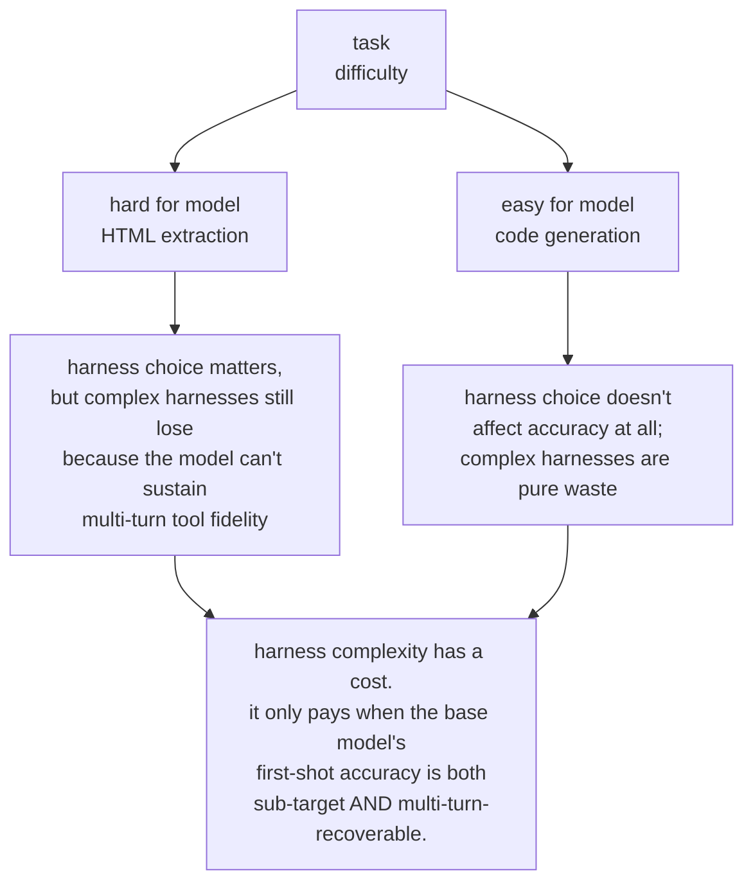

# harness_eng

**Same model, five harnesses, one benchmark.** A controlled experiment that holds one LLM constant and varies only the agent harness around it. Two task types, two published runs, one consistent methodology lesson.

## Two published writeups

### 1. HTML extraction — the "hard tasks" experiment

**[Read it → article-glm-20260423](writeup/article-glm-20260423.html)**

Tasks: pull 3–5 fields from 5 messy HTML pages. `glm-4.7-flash` struggles on these — the ceiling is low enough that harness design should matter.

- **5 harnesses × 5 tasks × 3 seeds = 75 cells**
- Success spread: **1.5×** (single_shot/plan_execute 9/15 tied top; react 2/15 bottom)
- Wall-clock spread: **9×** (217s vs 1,957s)
- Key finding: **`single_shot` ties for best success at 1/9th the wall-clock of `plan_execute`** on a weak model. Complex harnesses like `react` and `plan_execute` get 87.6% of their CSS selectors wrong; the rigid plan-then-execute split retries one wrong selector 417 times.

### 2. Code generation — the "easy tasks" experiment

**[Read it → article-code-glm-20260423](writeup/article-code-glm-20260423.html)**

Tasks: write 5 Python functions (fizzbuzz, fibonacci, anagram check, binary search, word count) that pass a pytest suite. These are well-specified enough that all five harnesses hit 100%.

- **5 harnesses × 5 tasks × 3 seeds = 75 cells** — different 5 harnesses including `test_driven`, `chain_of_thought`, `retry_on_fail`
- Success: **15/15 for every harness** — the ceiling is the task set, not the model
- Wall-clock spread: **2×** (single_shot 283s vs chain_of_thought 598s)
- Token spread: **6×** (retry_on_fail 6,168 in vs test_driven 35,469 in — all for the same 100% accuracy)
- Key finding: **with no accuracy to gain, complex harnesses are pure overhead.** `test_driven` runs pytest subprocesses that were going to pass anyway; `chain_of_thought` generates reasoning text before getting to the solution.

## Combined lesson

Across both experiments:



`single_shot` wins on wall-clock and tokens in BOTH experiments. If it hits your accuracy target, ship it. If it doesn't, the next question is whether your task's failures are multi-turn-recoverable — not whether "agentic patterns" are fashionable.

## Repository

- **Repo**: [github.com/jaafar-benabderrazak/harness-bench](https://github.com/jaafar-benabderrazak/harness-bench)
- **8 harnesses total**: `single_shot`, `react`, `plan_execute`, `reflexion`, `minimal` (HTML-family) + `chain_of_thought`, `test_driven`, `retry_on_fail` (code-gen-family)
- **2 task types**: `html_extract` + `code_gen`, deterministically graded (normalized exact match / pytest subprocess respectively)
- **55 tests** pass offline (no API key). CI runs on ubuntu + windows.
- Freeze tag `harnesses-frozen` pins the comparison; runner refuses to execute if any gated file has drifted.

## Reproduce either experiment

```bash
git clone https://github.com/jaafar-benabderrazak/harness-bench && cd harness-bench
pip install -e ".[dev]"
cp .env.example .env         # ollama + glm-4.7-flash by default, no API key needed
ollama pull glm-4.7-flash:latest
pytest -q                    # 55 tests, all offline

# HTML extraction matrix (~60 min)
python scripts/run_full.py --seeds 3 --yes

# Code generation matrix (~25-35 min)
python scripts/run_code_benchmark.py --seeds 3 --yes

# Post-process either — produces CSV, charts, article, trace viewer
python scripts/make_chart.py
```

All local. Zero API dollars.
