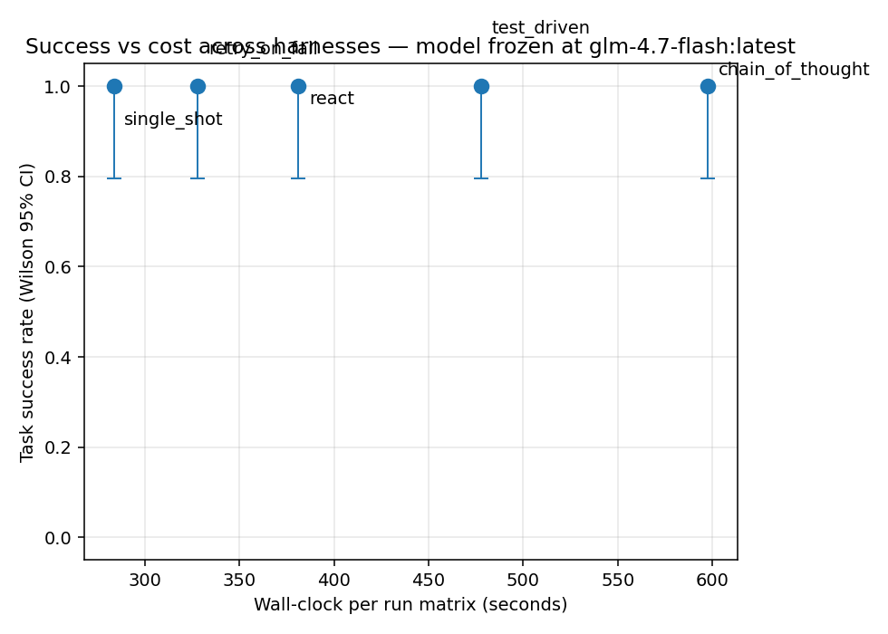
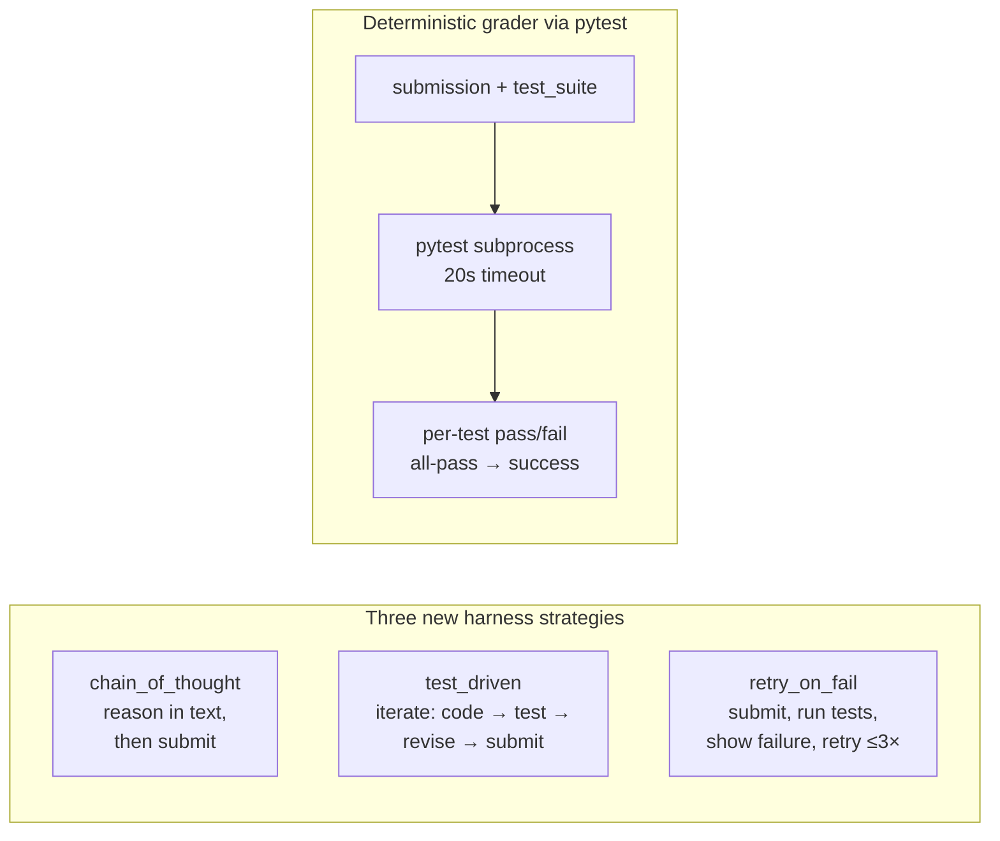
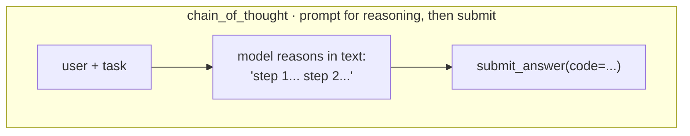
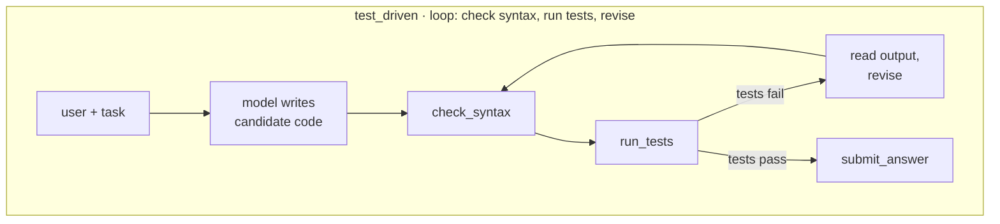
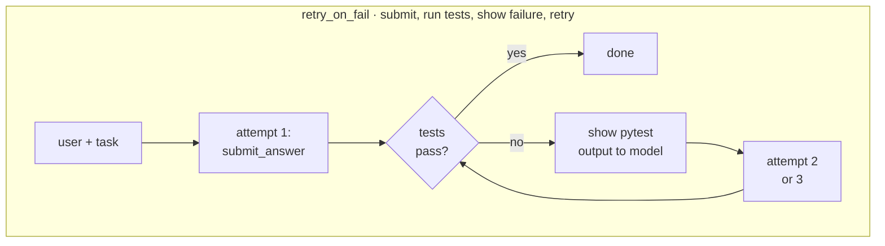
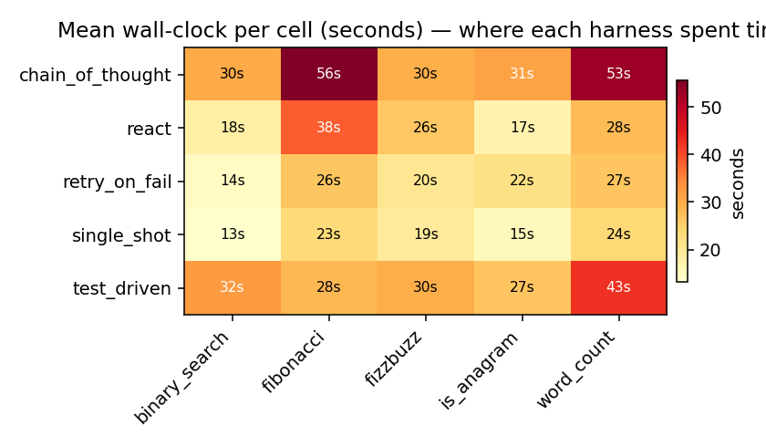
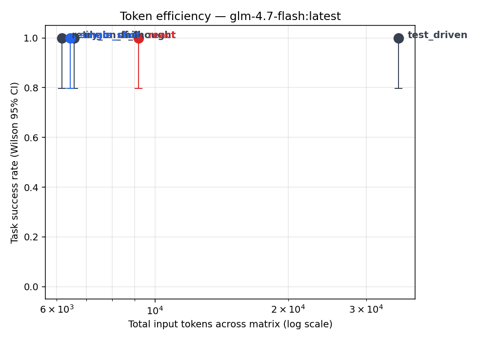

<script src="https://cdn.jsdelivr.net/npm/mermaid@11/dist/mermaid.min.js"></script>
<script>
document.addEventListener('DOMContentLoaded', () => {
  document.querySelectorAll('pre > code.language-mermaid').forEach((el) => {
    const d = document.createElement('div');
    d.className = 'mermaid';
    d.textContent = el.textContent;
    el.parentElement.replaceWith(d);
  });
  mermaid.initialize({ startOnLoad: false, theme: 'default', securityLevel: 'loose' });
  mermaid.run();
});
</script>

# Same model, five harnesses — now on code generation

*Second experiment in the series. Same frozen model (`glm-4.7-flash:latest`, local Ollama). Different task type: write Python functions that pass a pytest suite. Same 75-run matrix (5 harnesses × 5 tasks × 3 seeds). Code + data: [github.com/jaafar-benabderrazak/harness-bench](https://github.com/jaafar-benabderrazak/harness-bench). Sister article on HTML extraction: [article-glm-20260423](article-glm-20260423.html).*

---

## The finding in one sentence

**On easy, well-specified code tasks every harness scored 100% — so the question shifts from "which one works?" to "which one is wasteful?" And the answer is: the fancier the harness, the more time and tokens it burned for zero accuracy benefit.**



All five points sit at the top of the chart (15/15 success). What varies is horizontal: **single_shot took 283 seconds total for the whole matrix; chain_of_thought took 598 seconds for the same result.** Twice the wall-clock for zero additional wins. `test_driven` used 6× the input tokens of single_shot — all to run a test suite that was going to pass anyway.

This is a cleaner version of the lesson from the HTML article: **harness complexity has a cost, and you only get a return on that cost when the base model's single-shot accuracy is genuinely insufficient.** Below that threshold, complexity hurts. Above it, complexity is free money you're leaving on the table.

---

## What's new since the HTML article

Three new harness strategies designed specifically for code generation, plus a second task type with a different grader:



<details>
<summary><b>Why a code-gen task type at all? (motivation)</b></summary>

The HTML matrix showed that on a weak model, complex harnesses were actively harmful. The worry with that result is "maybe HTML extraction is just too easy; complexity can't help because the ceiling is already low." Code generation is a fundamentally different shape:

- Ambiguous solutions (many correct implementations pass the tests).
- Tests are part of the problem — harnesses like `test_driven` can USE them during solving.
- Failure is structured (a specific test fails with a specific AssertionError) so retry strategies have real signal to work with.

If there's ever going to be a task where `test_driven` beats `single_shot`, it's this one. Spoiler: on these particular tasks, it doesn't — but the *way* it fails to beat single_shot (it wastes tokens running tests that were already going to pass) is the interesting data.

</details>

---

## The new harnesses, schematic







Key difference between `test_driven` and `retry_on_fail`: `test_driven` can run tests *during* its thinking (iterate before committing). `retry_on_fail` only sees tests *after* it commits, and revises in a fresh attempt. That's closer to how a human developer iterates against a CI test suite.

---

## The setup

- **Task**: implement 5 Python functions, each with a pytest suite. Problems: `fizzbuzz`, `fibonacci`, `is_anagram`, `binary_search`, `word_count`. Each task includes a function signature (what to implement), a test suite (4–5 test functions with explicit assertions), and a reference solution (author's — used only to sanity-check the task is well-posed).
- **Grader**: write the model's submission + the task's tests to a tempdir, run `pytest -v`, parse per-test PASSED/FAILED. Success := pytest exit 0.
- **Model**: same frozen `glm-4.7-flash:latest` (19 GB, Ollama local, temperature 0, max_tokens 2048).
- **Harnesses** (the five-way matrix):
  1. **single_shot** — prompt + signature, submit code in one call.
  2. **react** — the classic think/act/observe loop (even though we don't expect it to need tools here).
  3. **chain_of_thought** — explicitly prompts for "step 1, step 2, ..." reasoning before the code.
  4. **test_driven** — can call `check_syntax` and `run_tests` as tools to verify before submitting.
  5. **retry_on_fail** — one attempt, see pytest result, revise up to 3 times total.
- **Matrix**: 5 harnesses × 5 tasks × 3 seeds = **75 cells**, 0 API dollars (local inference).

---

## The result, translated

### Plain-language summary

**Every harness got every task right on every seed.** 15/15 across the board. The only thing that differed is how much time and tokens each one spent getting there.

| harness | wall-clock (total) | input tokens (total) | verdict |
|---|---:|---:|---|
| **single_shot** — just ask for the code | **283 s** | **6,438** | fastest and cheapest |
| **retry_on_fail** — submit, check, retry if needed | 328 s | 6,168 | second-fastest; ready if needed |
| **react** — loop with tools available | 381 s | 9,189 | 35% slower than single_shot, same result |
| **test_driven** — iterate against live tests | 478 s | **35,469** | 6× the tokens for zero accuracy gain |
| **chain_of_thought** — reason before answering | **598 s** | 6,573 | slowest; "think step by step" just makes it slow |

<details>
<summary><b>Show me the full table</b></summary>

| harness          | trials | successes | success rate | Wilson 95% CI  | input tok | output tok | tool calls | wall-clock (s) |
|------------------|-------:|----------:|-------------:|----------------|----------:|-----------:|-----------:|---------------:|
| single_shot      | 15     | 15        | 1.00         | 0.80 – 1.00    | 6,438     | 6,014      | 0          | 283            |
| retry_on_fail    | 15     | 15        | 1.00         | 0.80 – 1.00    | 6,168     | 6,685      | 0          | 328            |
| react            | 15     | 15        | 1.00         | 0.80 – 1.00    | 9,189     | 6,560      | 0          | 381            |
| test_driven      | 15     | 15        | 1.00         | 0.80 – 1.00    | 35,469    | 9,092      | **30**     | 478            |
| chain_of_thought | 15     | 15        | 1.00         | 0.80 – 1.00    | 6,573     | 11,561     | 0          | 598            |

Wilson 95% CIs are all 0.80 – 1.00 because we have 15 perfect runs per cell — the statistical floor at N=15 is 0.80, not 1.00. That just means "if we ran the matrix infinitely more, we couldn't prove the true success rate is higher than 80% at 95% confidence."

Interesting corner: `test_driven` was the only harness that actually used tools (30 `run_tests` calls across the 15 cells — ~2 per cell on average). The other harnesses including `retry_on_fail` submitted on the first attempt every time because their first attempt passed.

</details>

---

## Where the waste went



- `single_shot` runs every task in 13–24 seconds.
- `chain_of_thought` takes 30–56 seconds per task — the step-by-step reasoning is just tokens the model has to generate before getting to the code.
- `test_driven` sits at 27–43 seconds per task because it always runs at least one pytest cycle to verify (even when unnecessary).
- `fibonacci` and `word_count` are the slow ones for `chain_of_thought` (56s, 53s) — longer reasoning traces.



Everyone's at 100% success (top of the chart), but `test_driven` is off by itself on the far right of the log-scale token axis. **6,168 input tokens for retry_on_fail vs 35,469 for test_driven — 5.8× more tokens for the same accuracy.** On this task set, test_driven's deliberate caution is pure overhead.

<details>
<summary><b>Where test_driven's extra tokens went</b></summary>

`test_driven` ran the pytest subprocess 30 times across the full 75-cell matrix — that's 2.0 `run_tests` calls per cell on average, and on some cells up to 3. Each call feeds back the full pytest output (up to ~1,500 chars of pass/fail dump) into the model's context as a tool_result. The model sees that context on its next turn, so prompt tokens grow turn-over-turn.

The math:
- base prompt + signature ≈ 400 input tokens
- first model reply includes the code candidate ≈ 300 output tokens
- a run_tests result ≈ 300 input tokens (fed back to the model)
- second model reply ≈ 300 output tokens

With ~3 turns per cell that's 400 + 300 × 2 = 1,000 input tokens + 900 output tokens per cell. Times 15 cells ≈ 15k + 13k. The actual matrix saw 35k input + 9k output, so the input side blew up more than estimated — every retry feeds the *full* test output back, not just the summary.

The extra tokens are paying for "insurance against the first attempt failing." On this task set, the first attempt did not fail a single time. The insurance was not needed.

</details>

---

## What surprised me

### 1. Every harness scored 100%

Going in I expected at least `retry_on_fail` to justify its existence by rescuing a failed first attempt. It didn't — because no first attempts failed. `glm-4.7-flash` at max_tokens=2048 solved every one of these five textbook programming problems on the first try, across 15 total attempts per harness.

This is an honest result but a specific one. The tasks were chosen to be testable and unambiguous. Harder or less-specified problems — ones where the model's first attempt actually fails — would produce a very different shape. Whether `test_driven`'s "verify before submitting" loop eventually pays is a question for a benchmark where it can demonstrably catch real failures. Here, it never had the chance.

### 2. `chain_of_thought` is expensive and offers nothing here

The prompt-for-reasoning pattern is everywhere in agent-engineering posts. On these tasks, "think step by step" produced an extra 2× wall-clock over `single_shot` with the same success rate. The reasoning tokens weren't unlocking new accuracy — they were just tokens the model had to generate before getting to the answer.

This isn't an argument against CoT prompting in general. Problems that genuinely benefit from reasoning (multi-step math, constraint satisfaction, code that *doesn't* have a standard one-shot solution) might need it. Toy algorithms the model already knows by heart do not.

### 3. `test_driven`'s tool-use was impressive but wasteful

`test_driven` successfully called `run_tests` 30 times across the matrix and responded correctly to pytest output — when a first draft was imperfect (in a handful of cells), it actually revised and re-tested. The tool-use plumbing works. But because the first draft was already correct most of the time, most of those 30 tool calls were "run tests on code I already know works" — pure confirmation.

On tasks where the first attempt has a realistic failure probability, this pattern would be valuable. Matching the harness to the task is everything.

### 4. Cross-experiment contrast with the HTML article

On HTML extraction (the [sister article](article-glm-20260423.html)):
- Tasks were genuinely hard for this model — `react` scored 2/15, `minimal` 4/15.
- Harness design mattered hugely. Rankings had a 1.5× spread in success.
- But the simpler harnesses (`single_shot`, `plan_execute`) tied for best — complexity didn't pay.

On code gen (this article):
- Tasks were easy for this model — everyone scored 15/15.
- Harness design only affects wall-clock and tokens now.
- `single_shot` is fastest and cheapest — complexity pays negative dividends.

Both experiments converge on the same lesson from different angles: **harness design matters most when the task is hard enough for the base model to struggle, and matters least when it isn't. In neither case does complexity automatically help.**

---

## Implications

1. **Run `single_shot` first, always.** If it hits your accuracy target, you're done. Don't spend tokens on elaborate harnesses that give you no additional wins.

2. **The value of `test_driven`-style harnesses is conditional on first-shot failure rate.** Estimate that rate with a single_shot pilot before investing. If first-shot success is already >90%, `test_driven` is paying a 6× token tax for nothing.

3. **`chain_of_thought` is not free.** It adds latency and tokens in exchange for reasoning quality improvements that may or may not be there. Measure — don't assume.

4. **Tasks determine the winning harness, not the other way around.** Code generation where first-attempts succeed → single_shot. Code generation where first-attempts fail meaningfully → test_driven or retry_on_fail. Knowing which regime you're in is the prerequisite.

5. **A benchmark with a 100% ceiling is not useless — it's an efficiency test.** This matrix didn't differentiate harnesses on accuracy but it did on cost, and cost is a real engineering axis. A benchmark that has 100% accuracy ceiling but 9× efficiency spread is telling you something important about which harness to ship.

---

## Honest scope

- **5 tasks × 3 seeds × 5 harnesses = 75 cells is a pilot.** Every cell succeeded so the Wilson CI for each harness is [0.80, 1.00] — we can't statistically distinguish "really 100%" from "could be as low as 80% on a bigger sample."
- **The task set was intentionally well-posed.** A task set that included ambiguous problems, tricky edge cases, or multi-file codebases would likely produce a different picture.
- **The model is one open-source 19 GB checkpoint.** Harder models (Claude, GPT-4) would further dilute the "complex harness pays" argument here because they'd ALSO single-shot these problems. Weaker models might finally make `test_driven` earn its tokens.
- **Six tag-moves in the repo's commit log.** Every move documented in [`HARNESSES_FROZEN.md`](../HARNESSES_FROZEN.md). Most recent move was for the `single_shot` code-gen fix — the first code-gen matrix had single_shot crash because it unconditionally tried to read an HTML fixture; the fix branched on task type.

---

## Reproduce

```bash
git clone https://github.com/jaafar-benabderrazak/harness-bench && cd harness-bench
pip install -e ".[dev]"
cp .env.example .env       # ollama + glm-4.7-flash, no API key required
ollama pull glm-4.7-flash:latest
pytest -q                  # 55 tests offline
python scripts/run_code_benchmark.py --seeds 3 --yes
python scripts/make_chart.py
```

About 25–35 minutes of local compute for the code matrix. Zero dollars. The HTML matrix runs with `python scripts/run_full.py --seeds 3 --yes` — same model, different task set.

---

<details>
<summary><b>Repo + sister-article links</b></summary>

- [Full repo](https://github.com/jaafar-benabderrazak/harness-bench) — source, tests, all 8 harness implementations (5 HTML + 3 code-gen-specific), both task sets
- [HTML extraction article](article-glm-20260423.html) — sister experiment on the same model; different conclusions because tasks were hard
- [`HELD_OUT.md`](../HELD_OUT.md) — held-out fixtures decision (applies to both task sets)
- [`HARNESSES_FROZEN.md`](../HARNESSES_FROZEN.md) — freeze manifest + tag-move log
- Raw trace data lives in `traces/{harness}/{task}/*.jsonl`. Every number in this article is reproducible by running `python scripts/make_chart.py` on the committed run file
- Freeze commit for the numbers in this article: `66fd2ec` (`git rev-parse harnesses-frozen`)

</details>
