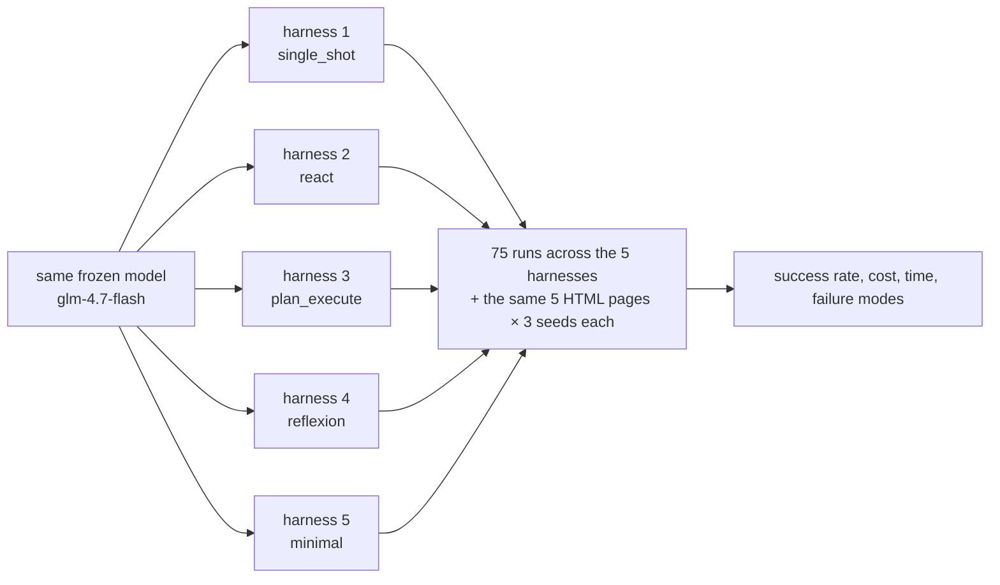
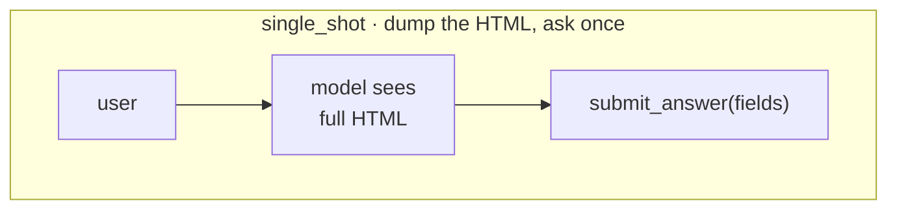
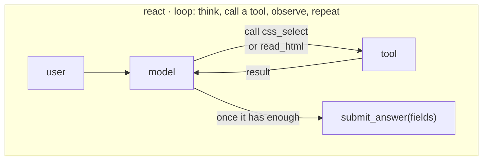
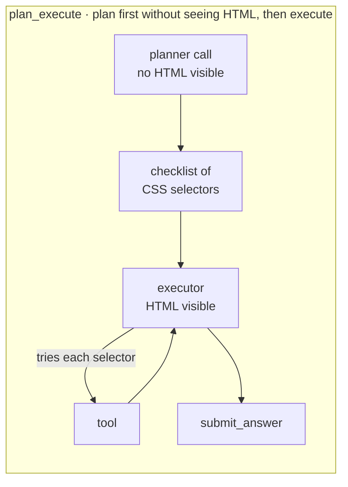
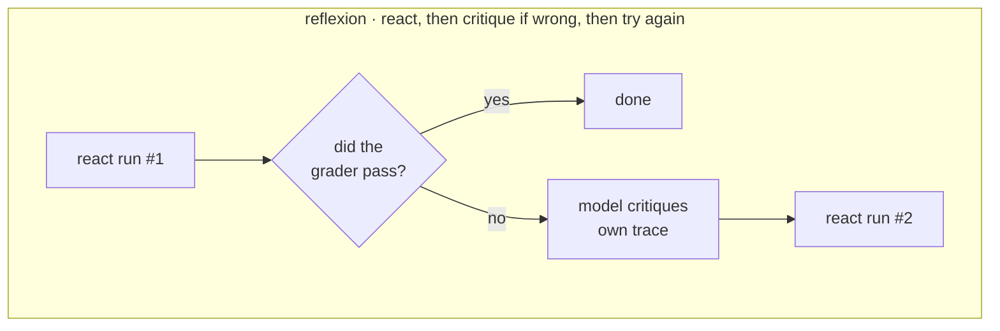
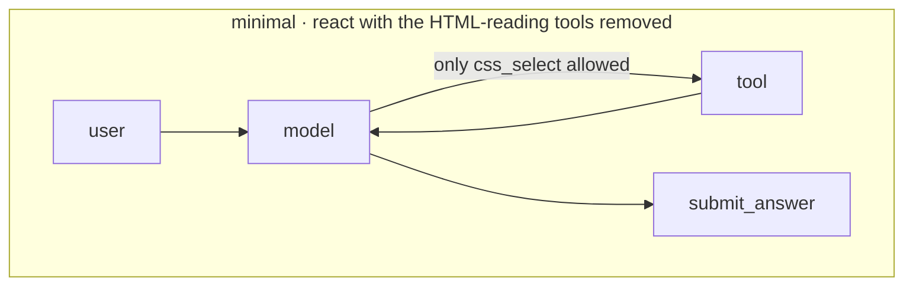
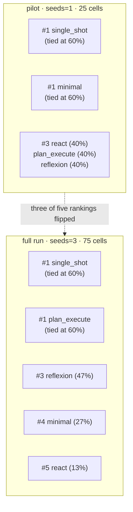

<script src="https://cdn.jsdelivr.net/npm/mermaid@11/dist/mermaid.min.js"></script>
<script>
document.addEventListener('DOMContentLoaded', () => {
  // Transform ```mermaid fenced blocks (rendered as <pre><code class="language-mermaid">)
  // into <div class="mermaid"> so mermaid.js picks them up.
  document.querySelectorAll('pre > code.language-mermaid').forEach((el) => {
    const d = document.createElement('div');
    d.className = 'mermaid';
    d.textContent = el.textContent;
    el.parentElement.replaceWith(d);
  });
  mermaid.initialize({ startOnLoad: false, theme: 'default', securityLevel: 'loose' });
  mermaid.run();
});
</script>

# Same model, five harnesses, one benchmark

*A controlled experiment on agent harnesses. Plain-language first; the forensics are tucked behind the "show me the numbers" toggles below each section.*

*Model: `glm-4.7-flash:latest` (free, open-source, runs locally on Ollama). Benchmark: 5 messy HTML pages, pull 3–5 fields from each. Ran it 75 times — 5 harnesses × 5 pages × 3 seeds. Code + data: [github.com/jaafar-benabderrazak/harness-bench](https://github.com/jaafar-benabderrazak/harness-bench).*

---

## The finding in one sentence

**The simplest way to use the model tied for best — and was nine times faster than the most elaborate approach.**


Five harnesses, same model. Two of them (the simple "just ask" approach and the "plan then execute" approach) both got the right answer on 9 out of 15 tries. But the simple one did it in **3.6 minutes total**; the elaborate one took **32 minutes**.

The "thought/action/observation loop" harness — the one most blog posts hold up as the default way to build an agent — came in last, with a confidence interval that clearly doesn't overlap the leaders. That ordering is the only one this experiment is statistically sure about.

---

## What is this actually about?

There's a popular idea floating around agent-engineering circles: the model is the main thing; the "harness" (the control loop that decides when to call tools and when to stop) is a minor detail. This experiment flips that: freeze the model, change only the harness, see how much the numbers move.



---

## The five harnesses

Each harness is a different way to ask the model to extract data from a webpage. They all use the **same** set of tools; what varies is the control flow around them.











Every harness finishes by calling the same `submit_answer` tool. That's on purpose — letting each one reply in free-form text would make the comparison messy.

---

## The result, translated

### Plain-language summary

| harness | got the answer | time | verdict |
|---|---|---|---|
| **single_shot** — just dump the HTML and ask | 9 of 15 | 4 min total | **winner on speed, tied on accuracy** |
| **plan_execute** — plan first, then execute | 9 of 15 | 33 min total | same accuracy, 9× the time |
| **reflexion** — try, critique, try again | 7 of 15 | 21 min total | middling |
| **minimal** — react with fewer tools | 4 of 15 | 14 min total | worse |
| **react** — classic agent loop | 2 of 15 | 4 min total | **clearly worst** (CI doesn't overlap the leaders) |

<details>
<summary><b>Show me the full numbers</b></summary>

| harness      | trials | successes | success rate | Wilson 95% CI   | field acc. | input tok | output tok | tool calls | wall-clock (s) |
|--------------|-------:|----------:|-------------:|-----------------|-----------:|----------:|-----------:|-----------:|---------------:|
| single_shot  | 15     | 9         | 0.60         | 0.36 – 0.80     | 0.88       | 10,713    | 4,116      | 0          | 217            |
| plan_execute | 15     | 9         | 0.60         | 0.36 – 0.80     | 0.76       | 106,611   | 38,475     | 642        | 1,957          |
| reflexion    | 15     | 7         | 0.47         | 0.25 – 0.70     | 0.63       | 85,462    | 24,035     | 114        | 1,269          |
| minimal      | 15     | 4         | 0.27         | 0.11 – 0.52     | 0.51       | 70,643    | 17,162     | 328        | 858            |
| react        | 15     | 2         | 0.13         | **0.04 – 0.38** | 0.37       | 19,632    | 3,172      | 30         | 220            |

The Wilson CI is the "statistical margin of error on the success rate." When two harnesses' intervals overlap, we can't call a winner between them at this sample size. `react`'s (0.04–0.38) does not overlap the leaders' (0.36–0.80) — that's the one ranking that's confidently real.

</details>

---

## Why the simplest one won

`single_shot` puts the whole HTML page into one message and says "fill out these fields." One call, one tool use, done. No loops. No retries. No clever planning.

The elaborate harnesses all share one vulnerability: they need the model to do the right thing **multiple turns in a row**. On this (weak-ish) open-source model, multi-turn tool-use is where things drift. Each extra turn is another chance for the model to try a wrong CSS selector, or emit a malformed tool call, or give up.


Every orange/red square above is a cell that took a long time because the harness was running in circles. `plan_execute` on `paper_01` alone burned **254 seconds** — over four minutes on one page.

<details>
<summary><b>Why plan_execute specifically collapsed (the damning number)</b></summary>

Across the whole matrix, `plan_execute` tried the CSS selector `span.date-submitted-date` **417 times**. That selector does not exist on any of the pages. The planner invented it. The executor fired it into the void 417 times because the harness has no feedback path — once the plan is written, the executor can only follow it.

**87.6%** of `plan_execute`'s CSS selector attempts returned nothing. Nearly nine out of ten selectors were wrong. The 12-turn cap is the only thing that stops the loop.

Top-5 selectors each harness retried most often (across the whole 75-cell matrix):

```text
plan_execute    417x  span.date-submitted-date      ← retried on every paper_01 cell
                 19x  h1
                 12x  .brand
                 12x  .price
                 10x  [itemprop="price"]

minimal           7x  h1
                  6x  [itemprop="name"], [itemprop="brand"], [itemprop="sku"]
                  6x  .brand, .brand-name, ...

reflexion        14x  .arxiv-id-number, .arxiv-id-text, ...
                  9x  .brand

react             4x  h1, h2, h3
                  3x  h1.title, span.primary-category, span.arxiv-id
```

None of plan_execute's top-3 selectors actually match the HTML on any page. The model kept guessing anyway because it couldn't see the HTML when writing the plan.

</details>

---

## The pilot run would have lied

Before the 75-cell matrix, I did a 25-cell pilot (one seed per cell instead of three). The pilot's rankings were **almost completely different**:



`minimal` dropped from tied-for-best to second-worst. `react` crashed from 40% to 13%. `plan_execute` jumped from bottom tier to tied-for-best. **If I'd published off the pilot, the headline would have been wrong.**

<details>
<summary><b>The delta table and why some harnesses are flakier than others</b></summary>

| harness      | seeds=1 (N=5) | seeds=3 (N=15) | Δ success  |
|--------------|---------------|----------------|------------|
| single_shot  | 0.60          | 0.60           | 0.00       |
| plan_execute | 0.40          | 0.60           | **+0.20**  |
| reflexion    | 0.40          | 0.47           | +0.07      |
| minimal      | 0.60          | **0.27**       | **−0.33**  |
| react        | 0.40          | **0.13**       | **−0.27**  |

Why the flippy ones flipped: each extra tool-use turn is another chance for randomness to move the outcome. A one-shot call has exactly one branch point. A 12-turn loop has 12 of them.

The summary CSV now ships a `seed_success_std` column that tells you which rows you can trust at single-seed:

| harness      | std across seeds | verdict                             |
|--------------|------------------|-------------------------------------|
| plan_execute | 0.00             | Deterministic — single seed enough. |
| single_shot  | 0.00             | Deterministic — single seed enough. |
| minimal      | 0.12             | Mild variance.                      |
| reflexion    | 0.23             | Flaky — needs more seeds.           |
| react        | 0.23             | Flaky — needs more seeds.           |

</details>

---

## Where each harness failed (the picture)


Every cell ends one of four ways:
- **submitted** (green) — the harness finished cleanly. Whether it was *right* is a separate question.
- **turn_cap** (orange) — ran out of the 12-turn budget without submitting.
- **error** (red) — the model emitted something the SDK rejected.
- **no_submit** (purple) — the model just stopped without calling `submit_answer`.

`single_shot` is pure green — it always cleanly submits. `react` is more than half red — it kept getting SDK-boundary errors. `plan_execute` (bar truncated above by the legend; full numbers are 12 submit / 3 turn_cap / 0 error / 0 no_submit) never technically errored, but nearly spent its full turn budget on every failure.

<details>
<summary><b>The specific SDK error that kills react and reflexion</b></summary>

The error is `ResponseError: mismatched arg_key and arg_value counts: 0 keys, 1 values`. It means the model emitted a tool call where the argument shape didn't parse — a small formatting issue at the SDK boundary.

This is bad for multi-turn harnesses because:
- `react` hits it on 8/15 cells (more than half). Each one aborts the run.
- `reflexion` hits it on 5/15 cells. The critique-and-retry loop can't fix it because *the critique treats it as a reasoning error when it's actually a formatting error.* The retry hits the same wall.
- `single_shot` avoids it almost entirely because it only makes one model call per cell.

A production harness would catch this kind of error, repair the tool call, and continue. Ours doesn't — and the cost shows up as 20% of react's cells and 33% of reflexion's cells just giving up.

</details>

---

## Tokens spent vs answers right


Here's the uncomfortable part: **more tokens did not buy more accuracy** on this model. `single_shot` spent 10,713 input tokens across the full matrix and got 60% right. `plan_execute` spent **ten times that** and got the same 60% right. `react` spent twice single_shot's tokens and got the *worst* result.

If you were paying a per-token bill, `single_shot` wins on every axis. If you're paying a per-minute local-inference bill, `single_shot` still wins by a lot.

---

## The takeaways

1. **Start with `single_shot` as your baseline, always.** If your fancy harness doesn't beat it, something is wrong — either the harness or the base model.

2. **Don't publish a harness comparison at one seed per cell.** Three of five of mine flipped between N=5 and N=15. Always include variance info in your reporting.

3. **Match harness complexity to your model's tool-use reliability.** If the model can't cleanly call one tool on the first try, it won't survive a twelve-turn loop of tool calls.

4. **`plan_execute` needs a way for the executor to fix the plan.** Otherwise the planner's first bad guess becomes 12 turns of retries on a dead selector. A simple `revise_plan` tool would have saved 60% of this harness's failed cells.

5. **Catch tool-call formatting errors in the harness, not in the SDK.** The `mismatched arg_key` error wasted ~13 cells across the matrix. A one-line retry would have recovered most of them.

6. **`minimal`'s tool restriction trades tokens for time.** You save tokens by forbidding `read_html`, but you spend more time because the model spray-tries selectors. Know which resource you're optimizing.

7. **"Harness design dominates model choice" is true only inside a model tier.** Below some capability threshold, the model is the bottleneck and scaffolding tricks don't help. `glm-4.7-flash` is clearly below that threshold; a different model might reshuffle the whole story.

---

## Honest scope (the caveats)

This run is **one open-source model** at **5 tasks × 3 seeds**. It's a pilot, not the final word:

- The confidence intervals still overlap among the top three harnesses. Only `react`'s worst-of-five ranking is statistically solid.
- All 5 fixtures were visible while building the harnesses (see [`HELD_OUT.md`](../HELD_OUT.md) for the decision and why).
- A Claude Sonnet or GPT-4 run might produce a very different ordering — and that's actually the most interesting follow-up.

The harness freeze tag moved six times during development — every move is logged in [`HARNESSES_FROZEN.md`](../HARNESSES_FROZEN.md), and none of them happened after a matrix was run. No peek-and-patch.

---

## Run it yourself

```bash
git clone https://github.com/jaafar-benabderrazak/harness-bench && cd harness-bench
pip install -e ".[dev]"
cp .env.example .env       # defaults to ollama + glm-4.7-flash — no API key needed
ollama pull glm-4.7-flash:latest
pytest -q                  # 49 tests run offline
python scripts/run_full.py --seeds 3 --yes
python scripts/make_chart.py
```

About an hour of compute on a modest laptop. Zero dollars. Everything reproduces exactly.

---

<details>
<summary><b>Repo + methodology links</b></summary>

- [Full repo](https://github.com/jaafar-benabderrazak/harness-bench) — source, tests, all five harness implementations
- [Offline demo](https://github.com/jaafar-benabderrazak/harness-bench/blob/main/scripts/demo_matrix.py) — exercises the whole pipeline with a deterministic fake model (no API spend)
- [`HELD_OUT.md`](../HELD_OUT.md) — held-out fixtures decision
- [`HARNESSES_FROZEN.md`](../HARNESSES_FROZEN.md) — freeze manifest + tag-move log
- [`README.md`](../README.md) — quickstart and the pre-registered hypothesis
- Raw trace data lives in `traces/{harness}/{task}/*.jsonl`; every number in this article is reproducible by re-running `python scripts/make_chart.py` on a committed run
- Freeze commit for the numbers in this article: `05554d3` (`git rev-parse harnesses-frozen`)

</details>
