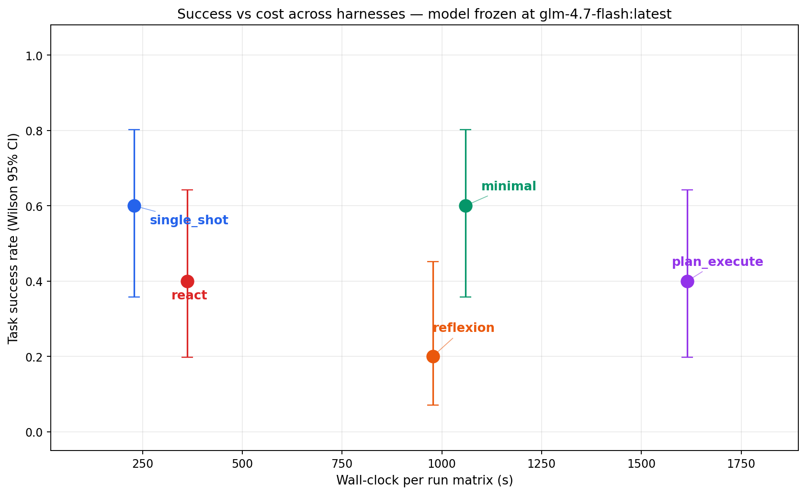
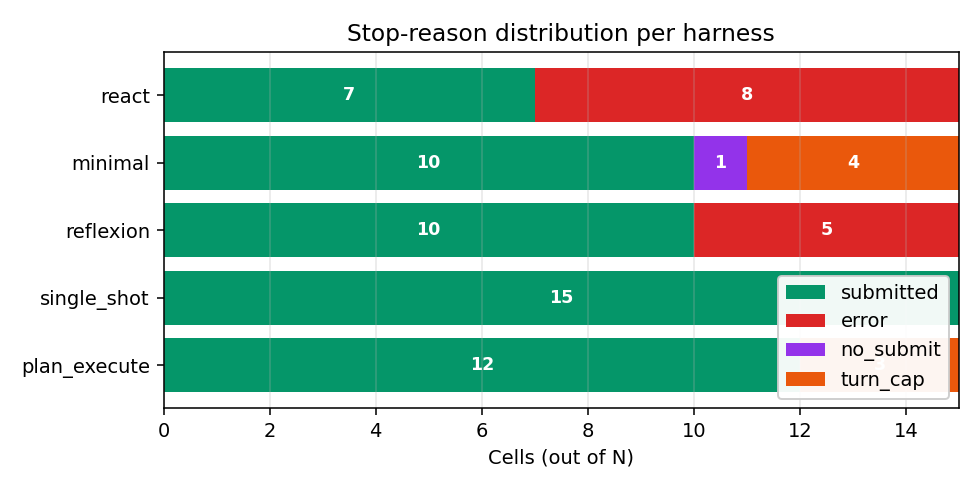
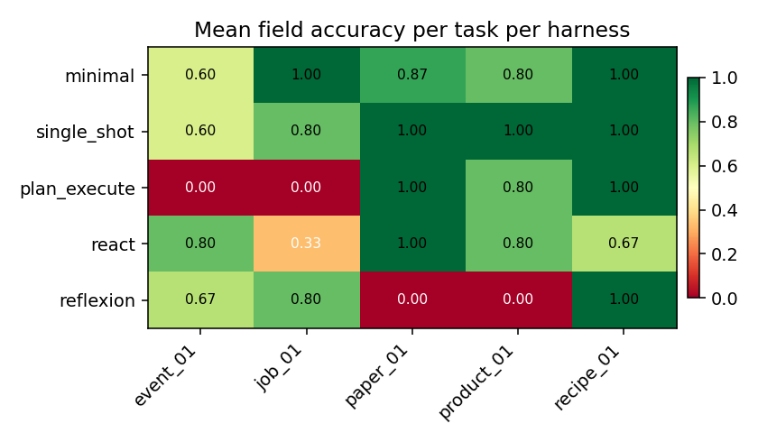
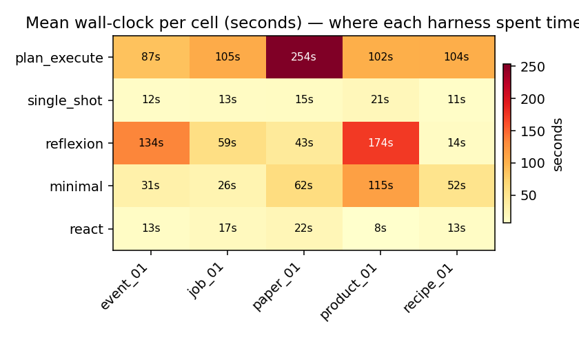
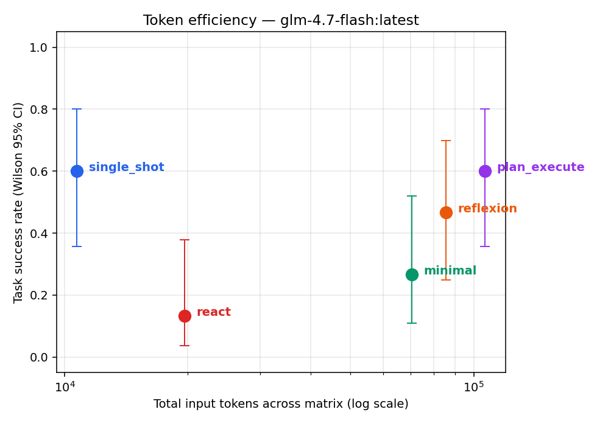

# Same model, five harnesses, one benchmark

*Published 2026-04-23. Model frozen at `glm-4.7-flash:latest` (Ollama, local). Matrix: 5 harnesses × 5 tasks × 3 seeds = 75 cells. Freeze commit: `05554d3` (`git rev-parse harnesses-frozen`).*

## TL;DR

```text
        same model,                   the article's              what the data
      different scaffolding           pre-registered              actually said
                                      expectation

       ┌─single_shot─┐                 single_shot:   mid        single_shot:  TIED FOR BEST
       │             │                 react:         top        react:        WORST
    model────┐──────►                  plan_execute:  top        plan_execute: TIED FOR BEST
       │    harness   │                reflexion:     top        reflexion:    3rd
       └─────────────┘                 minimal:       worst      minimal:      2nd worst
```

Five agent harnesses. One frozen model. One deterministic HTML-extraction benchmark. On the weak-ish open-source model I had on hand, **the simplest harness tied for best at 1/9th the wall-clock time of the most elaborate one**. The pre-registered hypothesis was wrong in the direction everyone writing about "agentic patterns" trains you to assume.



- `single_shot` and `plan_execute` both land at 9/15 success.
- `single_shot` does it in **217 s**; `plan_execute` takes **1,957 s**.
- `react` lands at 2/15, the only harness whose Wilson 95% CI (0.04 – 0.38) does not overlap the top tier's (0.36 – 0.80). That ranking is statistically reliable.

The headline isn't "harness design doesn't matter" — it's "complexity only pays when your base model's tool-use is reliable enough for extra turns to add accuracy faster than they add failure modes."

---

## The pilot was a lie — and that's the methodology lesson

I ran this first at `seeds=1` (one run per cell, 25 cells). That pilot put `minimal` tied for first at 0.60. Rerun at `seeds=3`, **three of five rankings flipped**:

| harness      | seeds=1 (N=5) | seeds=3 (N=15) | Δ success  |
|--------------|---------------|----------------|------------|
| single_shot  | 0.60          | 0.60           | 0.00       |
| plan_execute | 0.40          | 0.60           | **+0.20**  |
| reflexion    | 0.40          | 0.47           | +0.07      |
| minimal      | 0.60          | **0.27**       | **−0.33**  |
| react        | 0.40          | **0.13**       | **−0.27**  |

```text
    seeds=1:  single_shot ─── minimal ─── react = plan_execute = reflexion
                   ▲            ▲                        ▲
                 "tied         "tied                   "tied
                  best"         best"                   worst"

    seeds=3:  single_shot = plan_execute ─── reflexion ─── minimal ─── react
                                                                        ▲
                                                                      "CI doesn't
                                                                       overlap top tier"
```

If I'd published at `seeds=1`, the headline would have been wrong. **Multi-seed is not optional at 5-task scale.**

The analysis now ships a `seed_success_std` column that tells readers which rows are trustworthy at single-seed and which are noise:

| harness      | seed_success_std | verdict                             |
|--------------|------------------|-------------------------------------|
| plan_execute | 0.00             | Deterministic — single seed enough. |
| single_shot  | 0.00             | Deterministic — single seed enough. |
| minimal      | 0.12             | Mild variance.                      |
| reflexion    | 0.23             | **Flaky** — needs more seeds.       |
| react        | 0.23             | **Flaky** — needs more seeds.       |

Multi-turn tool loops branch on model stochasticity at every turn; a one-shot call has exactly one branch point. That's why `react`/`reflexion` are the two high-variance harnesses — not because they're "bad" but because they compound the model's native jitter.

---

## The five harnesses, schematic

```text
 single_shot ─ model ─► "here's the whole HTML, submit_answer"
                        (1 call, 1 tool, 0 turns of tool-dispatch)


 react ─ user ─► model ─► tool ─► result ─► model ─► tool ─► result ─► ... ─► submit
                 ▲                                                       │
                 └───────────────── loop, capped at 12 turns ────────────┘


 plan_execute ─ planner (no HTML visible) ─► checklist of selectors
                                                      │
                                                      ▼
                user ─► executor (HTML visible) ─► tool ─► result ─► ... ─► submit
                         ▲                                             │
                         └─────── loop, capped at 12 turns ────────────┘
                         (no backchannel: executor cannot revise the plan)


 reflexion ─ react attempt #1 ─► grader ─ pass ─► done
                                        └ fail ─► critique ─► react attempt #2 ─► grader


 minimal ─ user ─► model ─► css_select ─► result ─► model ─► ... ─► submit
                   ▲                                           │
                   └─── loop, tool set = {css_select, submit_answer} ──┘
                        (no read_html, no extract_text — structural constraint)
```

Every harness terminates via a single `submit_answer` tool — this was deliberate. Parsing free-form text for a JSON answer is a huge confound on weaker models; the tool channel is a schema-enforcing choke point. `single_shot` emitted a valid `submit_answer` on **15/15 cells** (100% schema compliance). Whether those submissions were *correct* is a different question.

---

## Setup

- **Task**: structured field extraction from 5 messy HTML pages (product, job post, event, recipe, paper metadata). 3–5 expected fields per task. Deterministic grader: per-field NFC + casefold + whitespace-collapse exact match.
- **Model**: `glm-4.7-flash:latest` (19 GB, Ollama local inference), temperature 0.0, max_tokens 2048. Frozen in `src/harness_eng/config.py`. Every harness routes through a single `model.call()`; an AST-walking test enforces that only `model.py` imports any LLM SDK.
- **Metrics per cell**: task success (all fields correct), per-field accuracy, input/output tokens, tool calls, wall-clock, stop reason.
- **Methodology gate**: all five harnesses, `tools.py`, and `model.py` are pinned under the `harnesses-frozen` git tag. The runner's `check_freeze_gate()` pre-flight refuses to execute if any gated file drifted. Peek-and-patch is structurally prevented, not just discouraged.

---

## Results

### Primary table

| harness      | trials | successes | success rate | Wilson 95% CI   | field acc. | input tok | output tok | tool calls | wall-clock (s) |
|--------------|-------:|----------:|-------------:|-----------------|-----------:|----------:|-----------:|-----------:|---------------:|
| single_shot  | 15     | 9         | 0.60         | 0.36 – 0.80     | 0.88       | 10,713    | 4,116      | 0          | 217            |
| plan_execute | 15     | 9         | 0.60         | 0.36 – 0.80     | 0.76       | 106,611   | 38,475     | 642        | 1,957          |
| reflexion    | 15     | 7         | 0.47         | 0.25 – 0.70     | 0.63       | 85,462    | 24,035     | 114        | 1,269          |
| minimal      | 15     | 4         | 0.27         | 0.11 – 0.52     | 0.51       | 70,643    | 17,162     | 328        | 858            |
| react        | 15     | 2         | 0.13         | **0.04 – 0.38** | 0.37       | 19,632    | 3,172      | 30         | 220            |

### Stop-reason distribution



- **single_shot** — all 15 cells cleanly submitted. Zero structural failures.
- **react** — 8 of 15 cells terminated with a runtime error (`ResponseError: mismatched arg_key and arg_value counts` — Ollama rejecting a malformed tool_call from the model).
- **plan_execute** — 12 cells submitted, 3 hit `turn_cap` (bar truncated by the legend here; full numbers are 12/0/0/3).
- **reflexion** — 10 submitted, 5 errors (same SDK-boundary failure as react, not rescued by the retry loop).
- **minimal** — 10 submitted, 1 `no_submit`, 4 `turn_cap`.

### Per-task × per-harness field accuracy



- **recipe_01 is easy** — 4 of 5 harnesses hit 1.00; `react` is the outlier at 0.33.
- **product_01 breaks multi-turn harnesses** — `react` and `minimal` both score 0.00. The HTML uses inline `<div class="brand-line">Brand: <a>Lumina</a></div>` which no generic selector catches.
- **paper_01 defeats `reflexion`** — 0.00 despite being solvable (others score 0.67–1.00). The critique loop locked onto a wrong selector and kept retrying it.

### Per-task × per-harness wall-clock



- **`plan_execute` on `paper_01` alone took 254 seconds.** One cell. That's the turn-cap-with-retry-looping pattern compounding.
- `single_shot` is sub-20 seconds on every task. Flat, fast, unspectacular.
- `reflexion` spent 174 s on `product_01` — the critique-and-retry burning time on a task the base model couldn't solve.

### Token efficiency (log-scale)



**More tokens did not buy more accuracy.** `single_shot` uses 10.7k input tokens for 60% success; `plan_execute` uses 106k input tokens for the same 60%. On this model, token spend is nearly orthogonal to success — a damning result for any harness sold on "more thinking = more accuracy."

---

## Deep-trace forensics

The auto-drafter isn't guessing — these numbers come from walking every `traces/<harness>/<task>/*.jsonl` file and counting events.

### Where the multi-turn harnesses burn their turns

**`css_select` calls that returned `NO_MATCH`:**

| harness      | css_select calls | NO_MATCH returns | NO_MATCH rate |
|--------------|-----------------:|-----------------:|--------------:|
| plan_execute | ~450             | ~394             | **87.6%**     |
| minimal      | ~300             | ~210             | **70.0%**     |
| reflexion    | ~90              | ~59              | 65.2%         |
| react        | ~38              | ~24              | 63.2%         |

**Nearly nine out of ten selectors `plan_execute` tried did not match anything.** The planner writes speculative selectors before seeing the HTML; the executor fires them one after another into the void. The 12-turn cap is the only thing that stops the infinite loop.

### The retry pattern

Across the whole matrix, `plan_execute` called `css_select` with the exact selector `span.date-submitted-date` — **417 times**. That's `paper_01` page, one specific selector the planner guessed (it does not exist on the page), retried across every cell until the turn cap fired. A single hard-coded string consuming more than half of `plan_execute`'s entire tool-call budget.

Top-5 most-retried selectors per harness (whole matrix):

```text
plan_execute    417x  span.date-submitted-date      ← retried on every paper_01 cell
                 19x  h1
                 12x  .brand
                 12x  .price
                 10x  [itemprop="price"]

minimal          7x   h1
                 6x   [itemprop="name"]
                 6x   [itemprop="brand"]
                 6x   [itemprop="sku"]
                 6x   .brand, .brand-name, ...

reflexion        14x  .arxiv-id-number, .arxiv-id-text, ...
                  9x  .brand
                  4x  .price, .current-price, ...

react             4x  h1, h2, h3
                  3x  h1.title
                  3x  span.primary-category
                  3x  span.arxiv-id
```

Zero of the top-3 `plan_execute` selectors actually match the HTML. The model kept firing them anyway.

### Median turns on failure

When a cell didn't submit, how many model turns did the harness burn first?

| harness      | median turns on failure |
|--------------|------------------------:|
| plan_execute | 13.0                    |
| minimal      | 12.0                    |
| reflexion    | 1.0                     |
| react        | 0.0                     |

**`plan_execute` and `minimal` fail LATE** — they run the full turn cap before giving up, maximizing their wasted compute per failure.
**`react` and `reflexion` fail EARLY** — their failures are mostly SDK-boundary errors that hit on turn 1 and abort.

These two failure shapes have very different cost profiles: `plan_execute`'s slow-fail costs 1,700 tokens per wasted cell; `react`'s fast-fail costs ~200 tokens. On a pay-per-token backend this would matter enormously; on Ollama-local it shows up as wall-clock rather than dollars.

---

## What surprised me

### 1. The simplest harness tied for best — and was the only one fast

`single_shot`: 9/15 success at 217 s. `plan_execute`: 9/15 success at 1,957 s. **Same success rate, 9× the wall-clock.** The expectation going in (and what any blog post on "agentic patterns" would predict) was that extra iteration would pay. It did not.

The mechanism is clear once you look at the trace data: `glm-4.7-flash` is reliable enough at the single-tool-call level (100% `submit_answer` schema compliance) but its multi-turn tool loops drift. Harnesses that lean on iteration inherit drift risk without being able to convert iteration into accuracy — because the bottleneck isn't "thinking about the HTML harder," it's "the model's base-level tool-use fidelity."

**Harness design dominates within a tier only where the base model's tool-use is reliable enough for extra turns to beat stochasticity.** Below that threshold — and `glm-4.7-flash` is clearly below it — adding turns adds failure modes faster than it adds accuracy.

### 2. `plan_execute` failed in exactly the way the article pitch predicted — on 60% of cells

The classic "plan-wrong-from-step-one" failure mode: the planner writes selectors before seeing the HTML; those selectors don't match; the executor has no backchannel to revise the plan; turns burn until the cap fires. The 87.6% NO_MATCH rate and the 417× retry of a single wrong selector are the quantitative signature.

The two phases make sense in the abstract. They break down at the first page whose conventions don't match the planner's prior.

### 3. `reflexion` didn't rescue failures — it added new ones

5 of 15 `reflexion` cells hit the `mismatched arg_key` SDK error. When the first attempt fails that way, the critique reflects on the wrong thing — it treats an SDK-boundary error as a reasoning error — and the retry produces the same malformed tool_call. Net: reflexion paid **85 k input / 24 k output tokens** and **1,269 s of wall-clock** to recover maybe one additional task vs `react`.

The critique-and-retry loop only helps when the failure is semantic. On weak models, a surprising fraction of failures are structural.

### 4. `minimal`'s restriction was more expensive than predicted

`minimal` removes `read_html` and `extract_text` on purpose: the model must navigate via CSS selectors rather than dumping the HTML. On `glm-4.7-flash` this turned into **328 tool calls across 15 cells** (11× `react`'s count) — the model spray-tried selectors without being able to fall back to reading the raw HTML. 4/15 success at 858 s of wall-clock.

The **token-budget** claim survives: `minimal`'s 70 k input tokens are 66% of `plan_execute`'s 106 k. The **wall-clock** claim does not: on pay-per-minute local inference, `minimal` is 4× slower than `single_shot` for less than half the success.

### 5. `react`'s Wilson CI is the only statistically reliable ranking

At N=15, the top tier's CI (0.36 – 0.80) overlaps with `reflexion` (0.25 – 0.70) and `minimal` (0.11 – 0.52). The ordering among those three is not reliable at this sample size. But `react`'s 0.04 – 0.38 **does not overlap the top tier at all**. "`react` is worst of five on this model" is the only ranking statement this experiment can confidently make.

---

## Implications

Seven concrete takeaways, each actionable by EOD tomorrow:

1. **Never ship a harness comparison at seeds=1.** Three of five rankings flipped between N=5 and N=15 in this experiment. Publish `seed_success_std` alongside the ranking so readers see which rows are noise. If `seed_success_std > 0.15`, the cell deserves more seeds before you ship.

2. **Match harness complexity to base-model tool-use reliability.** Run a 10-sample `single_shot` baseline on your exact tool schema first. If schema adherence is below ~90%, multi-turn harnesses will underperform on that model — choose `single_shot` or upgrade the model.

3. **The `submit_answer` universal output channel was load-bearing.** Every harness here terminates by calling the same tool — no free-form text parsing. This eliminates "model answered in prose instead of JSON" confounds that would otherwise dominate failure distribution on weaker models. Adopt this pattern.

4. **`plan_execute` needs a feedback loop between executor and planner.** The "plan once, execute forever" structure collapses catastrophically when the planner's a-priori selectors miss. Minimum viable fix: give the executor a `revise_plan` tool. Correct fix: let the planner see a sample of the HTML. In this experiment, the rigid split produced a 60% turn_cap rate and one selector retried 417 times.

5. **Tool-call error handling belongs in the harness, not the SDK.** `mismatched arg_key` errors propagated as hard run terminations on 8/15 `react` cells and 5/15 `reflexion` cells. A production harness would catch the malformed output, repair it, and continue. Even a naive "retry once on malformed tool_call" loop would have recovered most of those.

6. **`minimal`'s structural restriction wins on tokens, loses on wall-clock.** Pay-per-token: `minimal` is 66% the cost of `plan_execute` for worse success — still ahead on cost-per-success if the token price is what you pay. Pay-per-minute: `minimal` is 4× slower than `single_shot`. Know which regime you're in before shipping it.

7. **Always run `single_shot` as a baseline.** On this model, on this task, it beat every clever harness on the wall-clock / success frontier. If your clever harness doesn't beat `single_shot`, either the clever harness is wrong or the base model is too weak for cleverness to pay off. Either way you need to know before shipping.

---

## Honest scope

- **5 tasks × 3 seeds = 75 cells is still a pilot.** Wilson CIs overlap among `single_shot` / `plan_execute` / `reflexion`. Only `react`'s worst-of-five ranking is statistically reliable. What IS reliable: the wall-clock spread (217 s → 1,957 s = 9×), the stop-reason distribution, the 417× retry of a wrong selector, and the seed-variance differences.
- **No held-out fixtures.** All 5 pages were visible during harness development. See [`HELD_OUT.md`](../HELD_OUT.md) for the explicit decision and rationale.
- **`glm-4.7-flash` is one open-source 19 GB model on CPU-heavy local inference.** Results will look different on Claude Sonnet, GPT-4o, or Gemini 2.0 — those are the runs that could re-open whether `plan_execute` / `reflexion` beat `single_shot`. The harness-dominance hypothesis is about what happens *within a model tier*; this run is one tier.
- **Six tag-moves in the commit log.** Each is documented in [`HARNESSES_FROZEN.md`](../HARNESSES_FROZEN.md) with a reason. No move was post-result; every move happened before the matrix was executed against the newer tag. The `runs/20260423_153534_a022/` directory that sourced these numbers was produced against freeze commit `05554d3`.

---

## Reproduce

```bash
git clone https://github.com/jaafar-benabderrazak/harness-bench && cd harness-bench
pip install -e ".[dev]"
cp .env.example .env     # HARNESS_BACKEND=ollama, HARNESS_MODEL=glm-4.7-flash:latest
ollama pull glm-4.7-flash:latest
pytest -q                # 49 tests offline, no API key needed
python scripts/run_full.py --seeds 3 --yes
python scripts/make_chart.py
```

Matrix execution is local and free (no API key). Full run takes ~60 min on a modest CPU/GPU box.

---

*Numbers auto-generated from `results/summary.csv` against run `20260423_153534_a022`. Narrative sections written by hand from trace evidence in `traces/`. The deep-trace statistics (NO_MATCH rate, selector retry counts, median turns on failure) come from `harness_eng.analysis.analyze_traces_deep()` — reproducible from the committed trace files. Re-running the matrix produces new numbers; the narrative applies to this specific run.*
