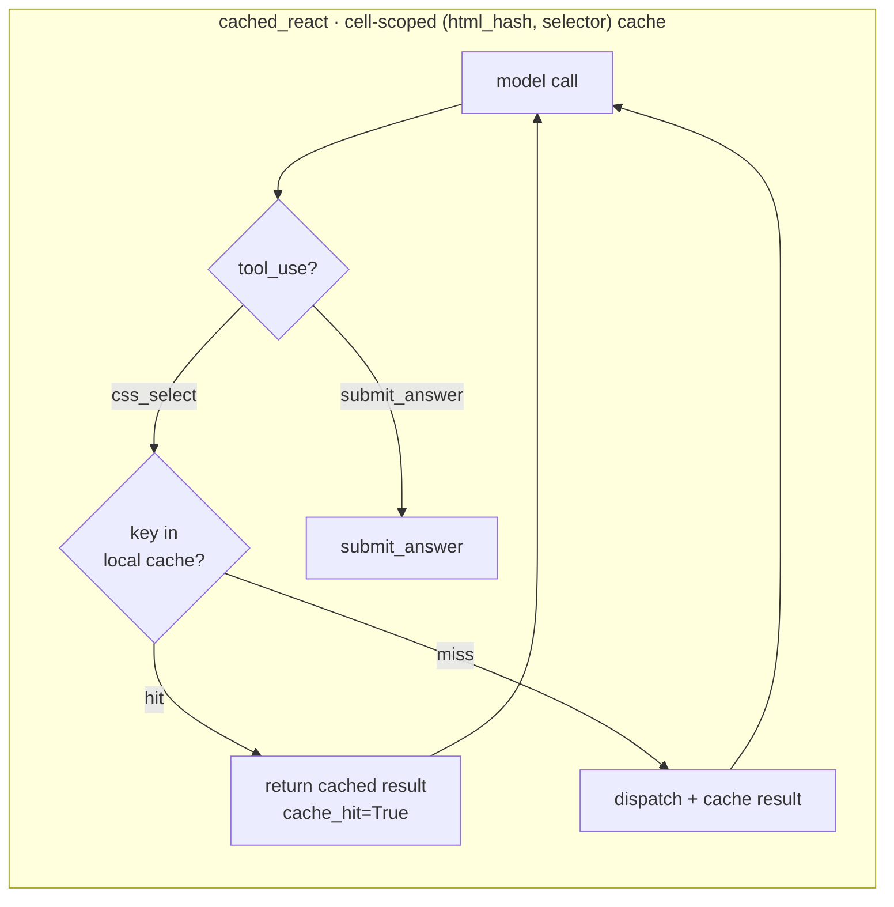

```mermaid
flowchart TB
    subgraph cr["cached_react · cell-scoped (html_hash, selector) cache"]
        direction TB
        M[model call] --> X{tool_use?}
        X -- css_select --> C{key in<br/>local cache?}
        C -- hit --> H[return cached result<br/>cache_hit=True]
        C -- miss --> D[dispatch + cache result]
        H --> M
        D --> M
        X -- submit_answer --> A["submit_answer"]
    end
```
