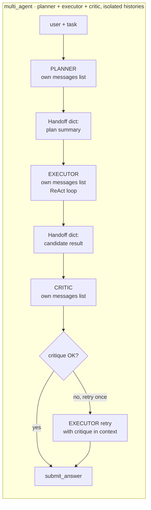

```mermaid
flowchart TB
    subgraph ma["multi_agent · planner + executor + critic, isolated histories"]
        direction TB
        T[user + task] --> Pl[PLANNER<br/>own messages list]
        Pl --> H1[Handoff dict:<br/>plan summary]
        H1 --> Ex[EXECUTOR<br/>own messages list<br/>ReAct loop]
        Ex --> H2[Handoff dict:<br/>candidate result]
        H2 --> Cr[CRITIC<br/>own messages list]
        Cr --> D{critique OK?}
        D -- yes --> A["submit_answer"]
        D -- no, retry once --> Ex2[EXECUTOR retry<br/>with critique in context]
        Ex2 --> A
    end
```
