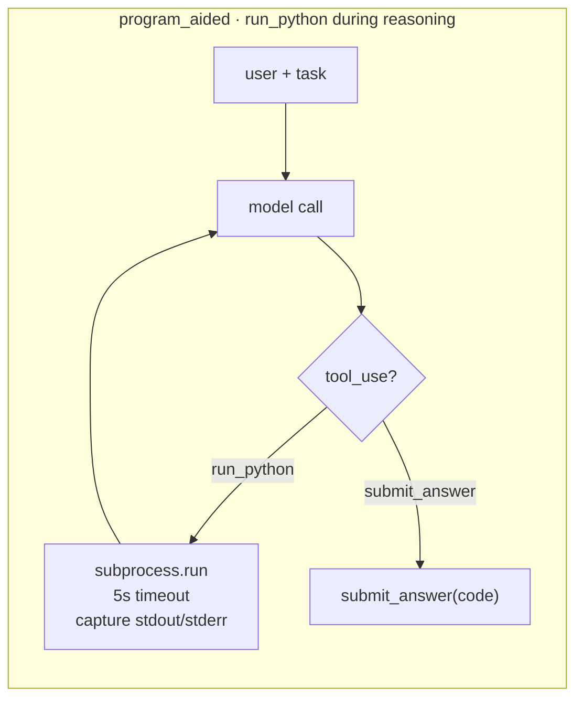

```mermaid
flowchart TB
    subgraph pal["program_aided · run_python during reasoning"]
        direction TB
        T[user + task] --> M[model call]
        M --> X{tool_use?}
        X -- run_python --> P["subprocess.run<br/>5s timeout<br/>capture stdout/stderr"]
        P --> M
        X -- submit_answer --> A["submit_answer(code)"]
    end
```
