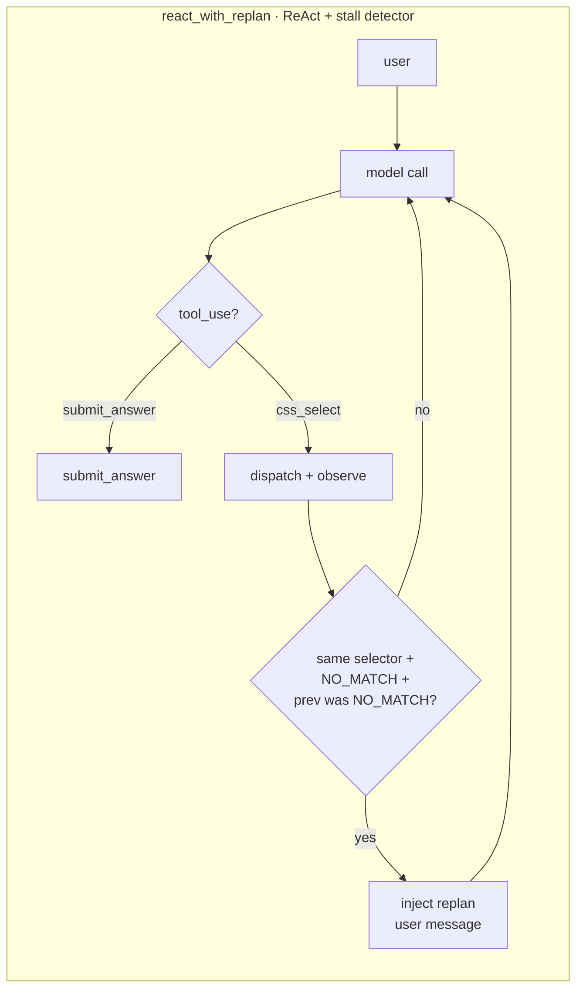

```mermaid
flowchart TB
    subgraph rwr["react_with_replan · ReAct + stall detector"]
        direction TB
        S[user] --> M[model call]
        M --> X{tool_use?}
        X -- submit_answer --> A["submit_answer"]
        X -- css_select --> D[dispatch + observe]
        D --> C{same selector +<br/>NO_MATCH +<br/>prev was NO_MATCH?}
        C -- yes --> R[inject replan<br/>user message]
        C -- no --> M
        R --> M
    end
```
