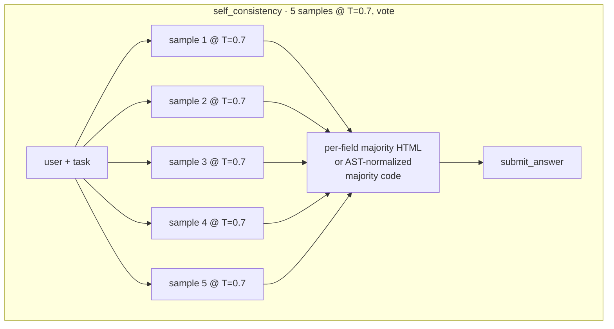

```mermaid
flowchart LR
    subgraph sc["self_consistency · 5 samples @ T=0.7, vote"]
        direction LR
        T[user + task] --> S1["sample 1 @ T=0.7"]
        T --> S2["sample 2 @ T=0.7"]
        T --> S3["sample 3 @ T=0.7"]
        T --> S4["sample 4 @ T=0.7"]
        T --> S5["sample 5 @ T=0.7"]
        S1 --> V[per-field majority HTML<br/>or AST-normalized<br/>majority code]
        S2 --> V
        S3 --> V
        S4 --> V
        S5 --> V
        V --> A["submit_answer"]
    end
```
