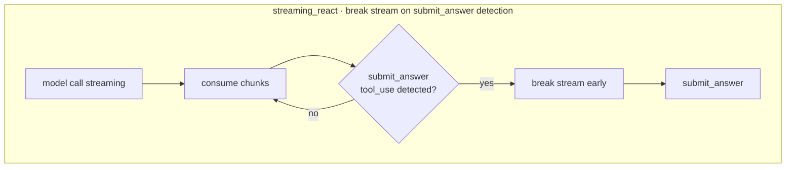

```mermaid
flowchart LR
    subgraph sr["streaming_react · break stream on submit_answer detection"]
        direction LR
        M[model call streaming] --> C[consume chunks]
        C --> D{submit_answer<br/>tool_use detected?}
        D -- no --> C
        D -- yes --> B[break stream early]
        B --> A["submit_answer"]
    end
```
