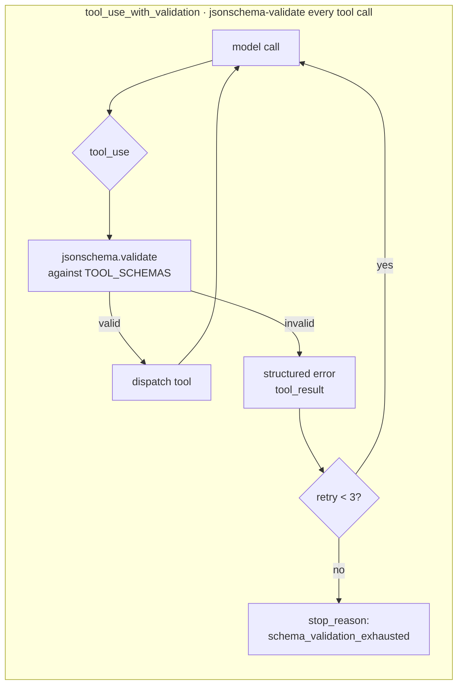

```mermaid
flowchart TB
    subgraph tuv["tool_use_with_validation · jsonschema-validate every tool call"]
        direction TB
        M[model call] --> X{tool_use}
        X --> V[jsonschema.validate<br/>against TOOL_SCHEMAS]
        V -- valid --> D[dispatch tool]
        D --> M
        V -- invalid --> E[structured error<br/>tool_result]
        E --> R{retry < 3?}
        R -- yes --> M
        R -- no --> F[stop_reason:<br/>schema_validation_exhausted]
    end
```
