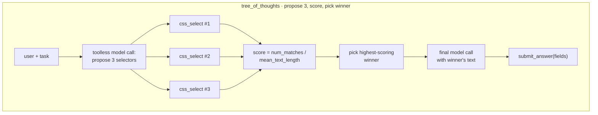

```mermaid
flowchart LR
    subgraph tot["tree_of_thoughts · propose 3, score, pick winner"]
        direction LR
        T1[user + task] --> T2[toolless model call:<br/>propose 3 selectors]
        T2 --> S1["css_select #1"]
        T2 --> S2["css_select #2"]
        T2 --> S3["css_select #3"]
        S1 --> SC[score = num_matches /<br/>mean_text_length]
        S2 --> SC
        S3 --> SC
        SC --> W[pick highest-scoring<br/>winner]
        W --> F[final model call<br/>with winner's text]
        F --> A["submit_answer(fields)"]
    end
```
